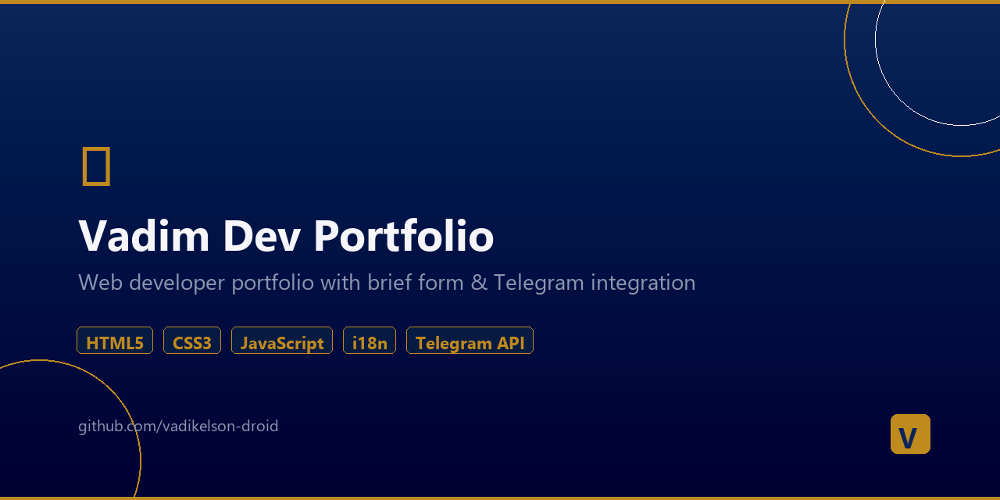

# 💼 Vadim Dev — Web Developer Portfolio

> Full-stack web developer portfolio with 10+ demo projects, brief form, pricing, and Telegram notifications.

## 🌐 Live
**[vadikelson-droid.github.io/vadim-portfolio](https://vadikelson-droid.github.io/vadim-portfolio/)**

## What's Inside

### Main Pages
| Page | Description |
|------|-------------|
| **index.html** | Main portfolio with services, projects, process |
| **presentation.html** | Agency-style business presentation |
| **brief.html** | Client brief form (7 sections, Telegram notifications) |
| **pricing.html** | Pricing packages (Start / Business / Premium) |
| **learning-plan.html** | Tech skills roadmap |

### Demo Projects (10+)
| Demo | Stack | Live |
|------|-------|------|
| **Photographer** | HTML/CSS/JS + Python API + SQLite | [View](http://91.219.61.4/photographer/) |
| **INFINITY Beauty** | HTML/CSS/JS, 5 languages | [View](http://91.219.61.4/infinity-beauty/) |
| **Grup Fauria** | Cinematic car dealership redesign | [View](http://91.219.61.4/fauria/) |
| **AutoPro** | Auto service with animations | [View](http://91.219.61.4/autoservice/) |
| **Sapore** | Restaurant with booking | [View](http://91.219.61.4/restaurant/) |
| **Bloom** | Beauty salon with particles | [View](http://91.219.61.4/beauty-salon/) |
| **Glow Beauty** | E-commerce shop | Demo |
| **Aroma** | Coffee shop landing | Demo |
| **Legal** | Lawyer website | Demo |

### Backend Projects
- **Telegram Bot** — Restaurant order processing bot (Python, aiogram 3.x, Poster POS integration)
- **Photographer API** — REST API with auth, image processing, CRUD (Python, aiohttp, SQLite)
- **VPS Infrastructure** — Nginx, SSL, firewall, automated deployment scripts

## Technologies
`HTML5` `CSS3` `JavaScript` `Python` `aiohttp` `aiogram` `SQLite` `Nginx` `Linux` `Git`

## Author
**Vadim** — Web Developer | [Telegram](https://t.me/lord_elson_05) | [Email](mailto:vadikelson@gmail.com)
